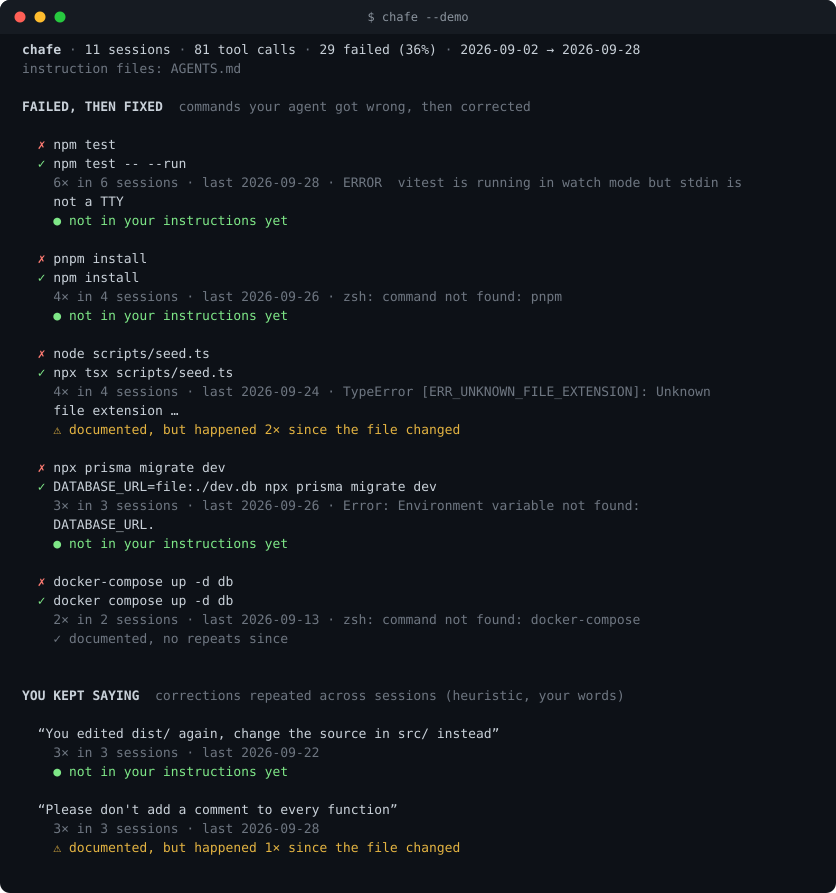
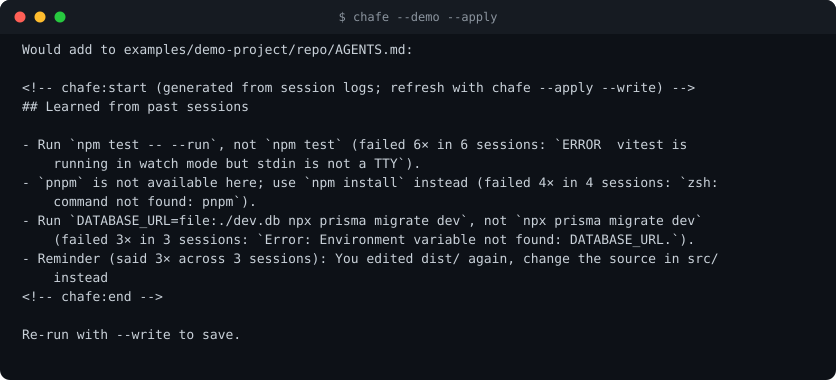
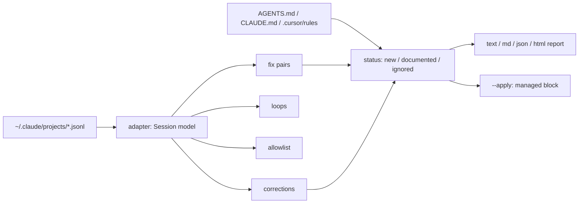

<h1 align="center">chafe</h1>

<p align="center"><b>Find where your coding agent keeps tripping, and turn it into AGENTS.md rules with the receipts.</b></p>

<p align="center">
  <a href="https://github.com/Nithinfgs/chafe/actions/workflows/ci.yml"></a>
  <a href="LICENSE"></a>
  
  
  
</p>

<p align="center"></p>

```bash
npx chafe --demo          # try it on bundled synthetic sessions, reads none of your logs
npx chafe                 # analyze the Claude Code sessions for the project you're standing in
```

> `npx chafe` is wired up and ready, but the package is not on npm yet. Until it is, use `npx github:Nithinfgs/chafe` (this builds on first run) or clone the repo, see [Quick start](#quick-start).

## The 20-second version

Claude Code already writes a log of every command it ran, whether it failed, and what you said when it got something wrong. **chafe reads those logs and looks for the same mistake happening across sessions:**

- **Failed, then fixed.** `npm test` failed, `npm test -- --run` worked. Four sessions in a row.
- **You kept saying.** The correction you've typed in different words in five sessions.
- **Retry loops.** The same failing call, three or more times in a row.
- **Safe to allow.** Read-only commands you keep approving, as a ready-made `permissions.allow` snippet.

Each finding is cited (how many times, how many sessions, the actual error) and checked against your existing `AGENTS.md` / `CLAUDE.md`, so you see:

| Status                           | Meaning                                                                                    |
| -------------------------------- | ------------------------------------------------------------------------------------------ |
| ● not in your instructions yet   | A rule would be new. `--apply` can add it.                                                 |
| ✓ documented, no repeats since   | Your instruction file covers it and the problem went away.                                 |
| ⚠ documented, but happened again | The rule exists and the agent still gets it wrong. Make it shorter, louder, or move it up. |

That last row is the point. Static linters can tell you a file is long or a path is dead. chafe tells you whether the instructions you wrote are changing anything.

<p align="center"></p>

## Why this exists

Instruction files grow one rule at a time, usually right after something annoying happens. Reports like [Addy Osmani's agent-file audit](https://addyosmani.com/blog/audit-your-agent-files/) describe the same drift: files balloon, adherence drops, and context files often fail to improve task success. The usual advice is "audit your agent files". Fine, but audit against what?

Your session logs are the ground truth for what actually goes wrong in _your_ repo. chafe uses them, deterministically and offline. It does not call an LLM, and nothing leaves your machine.

Related tools, and how this differs:

- **Instruction-file linters** (lintamigo, agents-lint, agent-config-lint, ...) check the file against the repo: dead paths, duplicates, size. chafe checks the file against _behavior_. Use both.
- **Usage dashboards** (ccusage, agent-retro, ...) show where tokens and time go. chafe is narrower: it produces rules and a permissions snippet, and tells you whether old rules worked.
- **Security scanners** (SkillSpector, mcp-audit, ...) look for malicious skills and leaky MCP configs. Different job.

## Quick start

Requires Node 20+. Currently reads **Claude Code** logs from `~/.claude/projects` (override with `--logs` or `CLAUDE_CONFIG_DIR`).

```bash
git clone https://github.com/Nithinfgs/chafe && cd chafe
npm install && npm run build
node dist/src/cli.js --demo            # see it work on synthetic data
```

Then, from inside any project you've used Claude Code in:

```bash
chafe                      # report for this project (last 60 days)
chafe --since 14d --min 3  # tighter: only patterns seen in 3+ sessions
chafe --apply              # preview rules for AGENTS.md (CLAUDE.md if that's all you have)
chafe --apply --write      # write them
chafe --permissions        # print a permissions.allow snippet for .claude/settings.json
chafe --all                # every project that has logs
chafe --format html > chafe-report.html   # also: md, json
```

## Example

```text
$ chafe --apply
Would add to AGENTS.md:

<!-- chafe:start (generated from session logs; refresh with chafe --apply --write) -->
## Learned from past sessions

- Run `npm test -- --run`, not `npm test` (failed 6× in 6 sessions: `ERROR vitest is running in watch mode…`).
- `pnpm` is not available here; use `npm install` instead (failed 4× in 4 sessions: `zsh: command not found: pnpm`).
<!-- chafe:end -->
```

Everything chafe writes lives inside the `chafe:start` / `chafe:end` block. Re-running replaces that block and never touches the rest of your file. Rules inside the block are ignored when deciding what counts as "already documented", so applying twice is stable.

## What it does and does not do

- **Evidence over opinion.** Every suggestion carries counts and the real error text. Secrets in commands are redacted (`API_KEY=…`, bearer tokens, `ghp_…`, URL passwords) and your home directory is shortened to `~`.
- **Deterministic.** Same logs in, same report out. No model calls, no network access, no telemetry.
- **Conservative.** Only plainly read-only commands are suggested for the allowlist (`git status`, `npm run lint`, ...), and anything with pipes, redirects or substitutions is skipped. One-off scripts and long pipelines are not treated as conventions.
- **Heuristic where it has to be.** "You kept saying" matches corrective phrasing ("don't...", "no, ...", "you edited...") and clusters by word overlap. It will miss some and occasionally merge unrelated messages. Treat it as a list of candidates and edit before saving. The `--apply` output is a draft, not an oracle.

## How it works



1. **Adapter** (`src/adapters/claudeCode.ts`) streams each JSONL log into an agent-neutral `Session`: tool calls with their results, plus your messages. Corrupt lines are skipped.
2. **Fix pairs** (`src/detectors/fixes.ts`): a failed Bash call followed, within a few calls, by a _changed_ version that worked. "Changed" means the command, normalized (values become placeholders, flags and env var names kept), differs. Missing-program errors pair with the replacement, and `node x.ts` pairs with `npx tsx x.ts` through the shared file argument. A command that merely passed on retry is ignored as flaky.
3. **Corrections** cluster by word overlap across sessions.
4. **Status** compares each finding to your instruction files: does the file already contain the fix? If so, did the problem recur after the file's last-modified time?
5. **Output** is a terminal report, Markdown, JSON or a self-contained HTML page, or a managed block in your instruction file.

A new agent is one file: implement `parseSessionFile` to emit the `Session` shape in `src/types.ts`. See [CONTRIBUTING.md](CONTRIBUTING.md).

## Use cases

- Your team's `AGENTS.md` has 80 rules and nobody knows which ones matter. Run chafe and see which ones are being ignored.
- You're tired of approving `git diff` forty times a day. `chafe --permissions`.
- You just joined a repo with a Claude Code history in your logs and want the project's tribal knowledge as rules.
- You want a before/after: write a rule, work for a week, run chafe again and see the ⚠ rows disappear or not.

## Configuration

There is no config file. Flags only:

| Flag                            | Default              | Meaning                                          |
| ------------------------------- | -------------------- | ------------------------------------------------ |
| `--since <30d\|2w\|1m\|date>`   | `60d`                | How far back to look                             |
| `--min <n>`                     | `2`                  | Sessions a pattern must appear in                |
| `--logs <dir>`                  | `~/.claude/projects` | Log directory (`CLAUDE_CONFIG_DIR` is respected) |
| `--format text\|md\|json\|html` | `text`               | Report format                                    |
| `--apply` / `--write`           |                      | Preview / save the rules block                   |
| `--permissions`                 |                      | Print a `permissions.allow` JSON snippet         |
| `--all`                         |                      | Analyze every project                            |
| `--demo`                        |                      | Use bundled synthetic sessions                   |

"Instructions last changed" is the instruction file's modification time. A fresh `git clone` resets it, so recurrence counts are most meaningful on a project where you've been working.

## Limitations

- Claude Code logs only for now. Codex, Cursor and others have different log formats; adapters are welcome.
- Developed and tested on macOS and Node 24. CI also runs Linux and Windows, but it has had far less real-world use there.
- The bundled demo is synthetic. The sample numbers in this README come from it, not from any real user.
- Fix pairs only look at the Bash tool. File-edit failures show up as retry loops, not as rules.

## Roadmap

- [ ] Codex CLI adapter
- [ ] `chafe diff <date>`: what changed since you last applied rules
- [ ] Per-subdirectory rules (nested `AGENTS.md`)
- [ ] GitHub Action that comments recurring friction on a PR
- [ ] Failure → fix pairs for non-Bash tools

## Contributing

Bug reports with a redacted log snippet are the most useful thing you can send. See [CONTRIBUTING.md](CONTRIBUTING.md). Security: [SECURITY.md](SECURITY.md).

```bash
npm install && npm test          # build + 24 tests
npm run lint && npm run format:check
node scripts/gen-demo.mjs        # regenerate the synthetic demo sessions
```

## License

[MIT](LICENSE)
